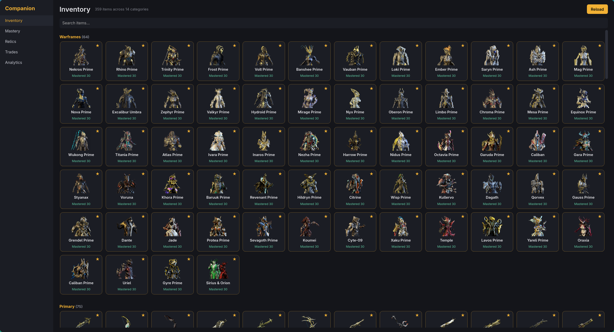
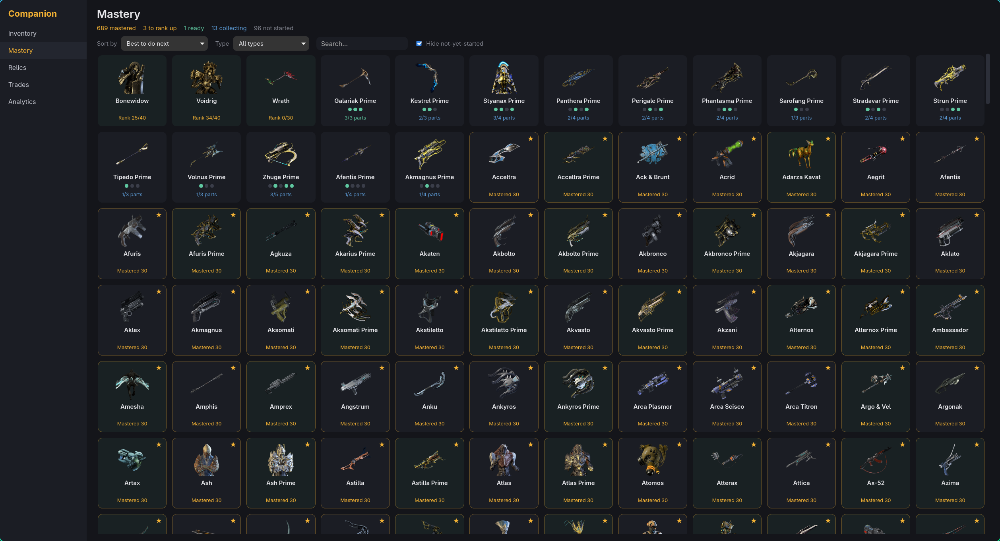
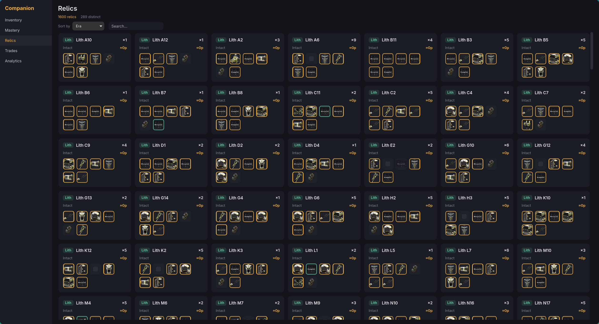
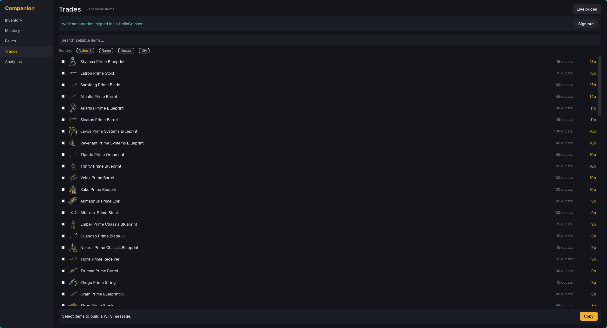
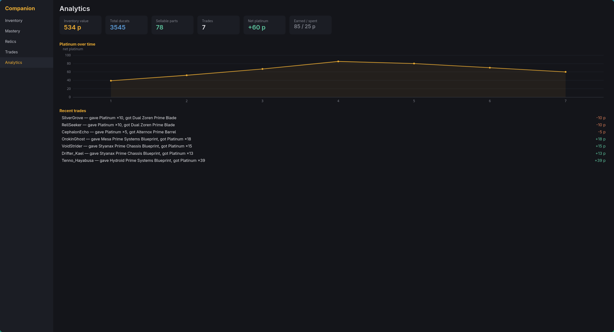

# Warframe Overlay (Linux)

A **Linux-native, Hyprland/Wayland** relic-reward overlay for [Warframe](https://www.warframe.com/) —
think [WFInfo](https://github.com/WFCD/WFinfo) — bundled with an
[AlecaFrame](https://alecaframe.com/)-style companion app, all in a single process.

It watches Warframe's `EE.log`, screenshots the relic-reward screen the moment it appears,
OCRs the four item names, prices them against warframe.market, and paints a **click-through overlay**
highlighting the most valuable pick. The companion window adds inventory browsing, mastery tracking,
relic drop tables, trade analytics, and warframe.market sell-order tooling.

> Built for the stack WFInfo/AlecaFrame don't cover: **Wayland + Hyprland**, no Windows, no X11.

## Screenshots

| Inventory | Mastery |
| --- | --- |
|  |  |

| Relics | Trades |
| --- | --- |
|  |  |



## Features

**In-game relic overlay** (runs in the background, no window)
- Detects the relic-reward screen from `EE.log` and captures the frame automatically.
- OCRs reward names (Tesseract) — isolating the text from full-body character renders behind
  blueprint rewards by voting over known UI accent palettes, with an Otsu-luminance fallback.
- Prices each reward in platinum (ducat tiebreaker) and draws a click-through layer-shell overlay
  marking the best pick. When your inventory is loaded, picks are decorated with
  mastery / owned / craftable status.

**Companion app** (Wails3 + Svelte window)
- **Inventory** — browse owned equipment by category with thumbnails, ranks and mastery status.
- **Mastery** — progress toward 100% mastery, computed from *lifetime affinity* (sold duplicates
  still count). Sort by *most actionable*, *cheapest to build*, or *most farmable from owned relics*;
  expand any item for its part requirements and build cost.
- **Relics** — your owned relic variants with full drop tables, sorted by era, expected platinum
  per crack, or count; refinement-aware drop odds.
- **Trades** — warframe.market integration: list sellable parts at live prices, build a `WTS`
  whisper, and post sell orders.
- **Analytics** — portfolio value, ducats, net-platinum-over-time chart, and recent trade history
  parsed from `EE.log`.

## How it works

The overlay pipeline:

```
logwatch (tail EE.log) → capture (screenshot) → ocr (read names) → pricing/db (value them) → overlay (draw)
```

The desktop app is the single user-facing entry point: it serves the companion UI **and** launches
the overlay pipeline in a background goroutine, both sharing the same `internal/*` domain packages.

| Package | Responsibility |
| --- | --- |
| `logwatch` | Tail `EE.log`, detect the reward screen, debounce, survive log rotation |
| `capture` | Grab a monitor frame over Wayland (screencopy / ext-image-copy / `grim` fallback) |
| `ocr` | Read reward names with Tesseract; theme-aware text isolation |
| `db` / `pricing` | Match OCR'd names to items and rank by plat/ducat value |
| `overlay` | Click-through `wlr-layer-shell` rendering via pangocairo |
| `inventory` | Scrape the running game's auth token and call DE's mobile inventory API |
| `mastery` / `relics` / `trades` | Domain logic behind the companion tabs |
| `wfmarket` / `wfdata` | warframe.market & warframestat.us clients (rate-limited, disk-cached) |
| `hypr` | `hyprctl -j` client — monitor geometry & HDR state |
| `wlproto` | Generated Wayland protocol bindings |

External data (prices, item metadata, relic drop tables) is cached under
`$XDG_CACHE_HOME/warframe-overlay-linux/` and **served stale on network failure**, so the app keeps
working when the upstream WFInfo endpoints are down.

## Requirements

- **Linux + Hyprland** (Wayland). The capture and HDR handling are Hyprland-specific.
- **Go 1.26+** with **cgo** enabled, and `pkg-config`.
- System libraries:
  - Overlay/OCR: `tesseract`, `tesseract-data-eng`, `grim`, `hyprland`, `cairo`, `pango`
  - Desktop app: `webkit2gtk`, `node`/`npm`, and the `wails3` CLI

`pkg-config` must be able to find `tesseract` and `lept`.

> **Inventory & mastery** read the running game's process memory to obtain a short-lived auth token,
> then call Digital Extremes' mobile API. This needs ptrace permission
> (`sudo sysctl kernel.yama.ptrace_scope=0`, or `setcap cap_sys_ptrace+ep` on the binary) and is
> **unsanctioned** use of DE's API. It fails gracefully and never blocks pricing or the overlay.

## Build & run

```sh
make build        # go build ./...        (all binaries + the overlay)
make test         # go test ./...
make desktop      # regenerate Wails bindings, build the Svelte frontend, build build/wfo-desktop
make run-desktop  # build + run; pass INV=dump/inventory.json to use a saved inventory
```

Then run the app:

```sh
./build/wfo-desktop
```

**No game required for development:** point it at a saved inventory JSON and it runs without ptrace:

```sh
make run-desktop INV=dump/inventory.json
# or
WFO_INVENTORY_FILE=dump/inventory.json ./build/wfo-desktop -no-overlay
```

### Flags / env vars

| Flag | Env | Description |
| --- | --- | --- |
| `-eelog <path>` | `$WFO_EELOG` | Path to Warframe's `EE.log` (defaults to the Steam Proton location) |
| `-monitor <name>` | | Force capture/overlay to a display (e.g. `DP-4`); empty = auto-detect focused |
| `-inventory-file <path>` | `$WFO_INVENTORY_FILE` | Load a saved inventory JSON instead of scraping the game |
| `-tab <name>` | `$WFO_TAB` | Initial tab (`Inventory`, `Mastery`, `Relics`, `Trades`, `Analytics`) |
| `-dump <dir>` | | Debug: write captured frames as PNG |
| `-no-overlay` | | Disable the in-game overlay (companion UI only) |
| `-v` | | Verbose logging |

## Dev / debug tools

Standalone binaries for tuning each pipeline stage offline — **not** part of the shipping app:

| Tool | Purpose |
| --- | --- |
| `wfo-capture` | Grab a single monitor frame as PNG; validate capture backends & the HDR→SDR path |
| `wfo-ocr` | Run OCR + pricing on a saved PNG; tune reward-box geometry and thresholds |
| `wfo-overlay` | Show a sample overlay on a monitor for a few seconds; validate layer-shell rendering |
| `wfo-inventory` | Scrape the running game's auth token and fetch / parse inventory JSON |

## Notes & caveats

- **Hyprland only.** Capture relies on `hyprctl` for monitor geometry and a Hyprland-specific
  HDR→SDR toggle (every Wayland capture path exposes crushed 8-bit buffers for HDR outputs, so the
  output is momentarily switched to SDR for the capture, then restored).
- **English OCR only** (`tesseract-data-eng`).
- The companion's inventory features are best-effort and depend on ptrace permission and DE's API
  being reachable; everything degrades gracefully when they aren't.

## Acknowledgements

Inspired by [WFInfo](https://github.com/WFCD/WFinfo) and [AlecaFrame](https://alecaframe.com/).
Item, price and relic data come from [warframe.market](https://warframe.market/) and
[warframestat.us](https://docs.warframestat.us/). Not affiliated with or endorsed by Digital Extremes.
